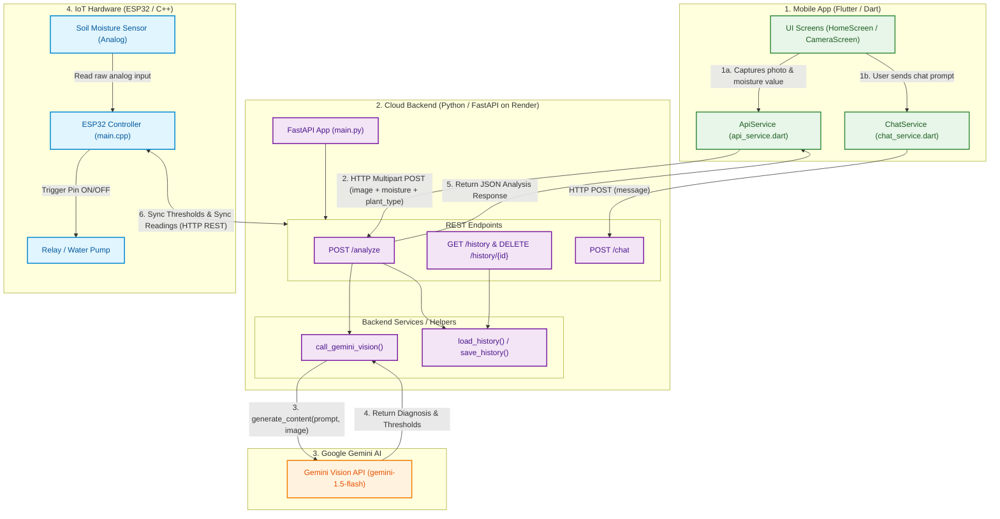
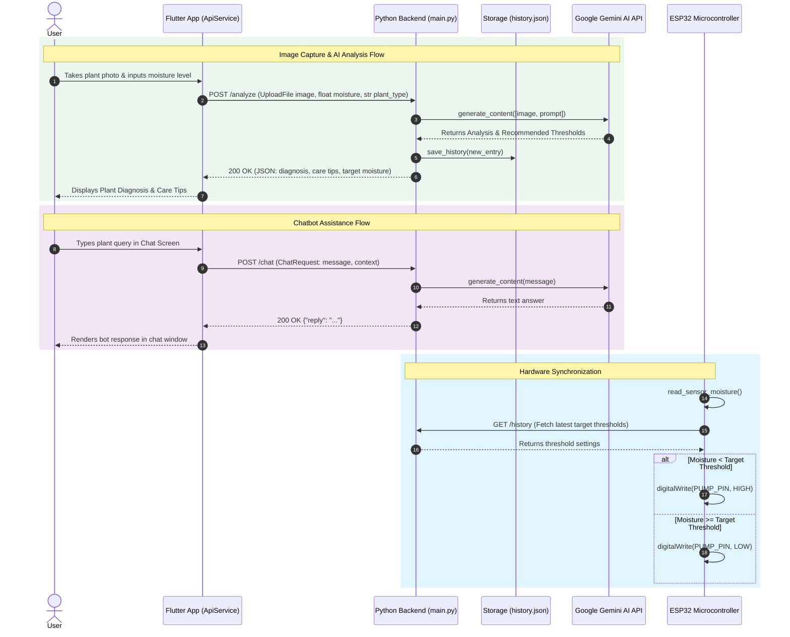

# 🌿 AquaMind - Detailed System Architecture & Function Calls

AquaMind is an end-to-end IoT Smart Irrigation & Botanical AI platform. The user captures a plant image and enters parameters via the Flutter Mobile App, which communicates with a Python FastAPI Backend hosted on Render. Google Gemini AI processes the image to analyze plant health and recommend dynamic watering thresholds, which govern the ESP32 IoT node.

---

## 🏗️ High-Level Function & Call Mapping

---

## 🔄 Function-Level Execution Flow

---

## 🛠️ Code Structure & Key Methods

### 1. Flutter Mobile App (`lib/services/`)

- **`api_service.dart`**:
  - `analyzePlant({File image, double moisture, String plantType})`: Sends multipart form request to `POST /analyze`.
  - `getHistory()`: Fetches past records from `GET /history`.
  - `deleteHistory(String id)`: Sends DELETE request to `DELETE /history/{id}`.
- **`chat_service.dart`**:
  - `sendMessage(String message)`: Posts user prompt to `POST /chat`.

### 2. Python Backend (`backend/main.py`)

- **`analyze_plant(image: UploadFile, moisture: float, plant_type: str)`**:
  - Decodes byte stream from image.
  - Formats AI prompt for Gemini.
  - Appends structured result into `history.json`.
- **`chat_with_bot(request: ChatRequest)`**:
  - Processes textual user Q&A via Gemini model.
- **`load_history()` / `save_history()`**:
  - Manages reading and writing local persistence data.
