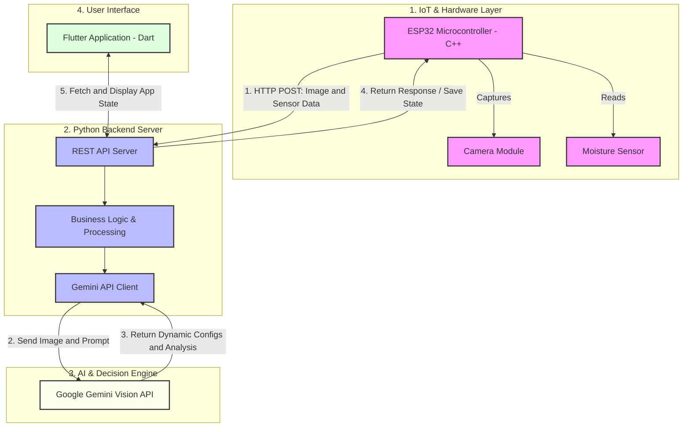

```mermaid
graph TD
    %% Styling
    classDef hardware fill:#f9f,stroke:#333,stroke-width:2px;
    classDef backend fill:#bbf,stroke:#333,stroke-width:2px;
    classDef ai fill:#ffe,stroke:#333,stroke-width:2px;
    classDef mobile fill:#dfd,stroke:#333,stroke-width:2px;

    %% Nodes
    subgraph IoT_Hardware ["1. IoT & Hardware Layer"]
        ESP32["ESP32 Microcontroller - C++"]:::hardware
        CAM["Camera Module"]:::hardware
        SENSOR["Moisture Sensor"]:::hardware

        ESP32 -->|Captures| CAM
        ESP32 -->|Reads| SENSOR
    end

    subgraph Cloud_Backend ["2. Python Backend Server"]
        API["REST API Server"]:::backend
        LOGIC["Business Logic & Processing"]:::backend
        GEMINI_SDK["Gemini API Client"]:::backend

        API --> LOGIC
        LOGIC --> GEMINI_SDK
    end

    subgraph AI_Engine ["3. AI & Decision Engine"]
        GEMINI["Google Gemini Vision API"]:::ai
    end

    subgraph Mobile_App ["4. User Interface"]
        FLUTTER["Flutter Application - Dart"]:::mobile
    end

    %% Flow Connections
    ESP32 -->|"1. HTTP POST: Image and Sensor Data"| API
    GEMINI_SDK -->|"2. Send Image and Prompt"| GEMINI
    GEMINI -->|"3. Return Dynamic Configs and Analysis"| GEMINI_SDK
    API -->|"4. Return Response / Save State"| ESP32
    FLUTTER <-->|"5. Fetch and Display App State"| API
```
