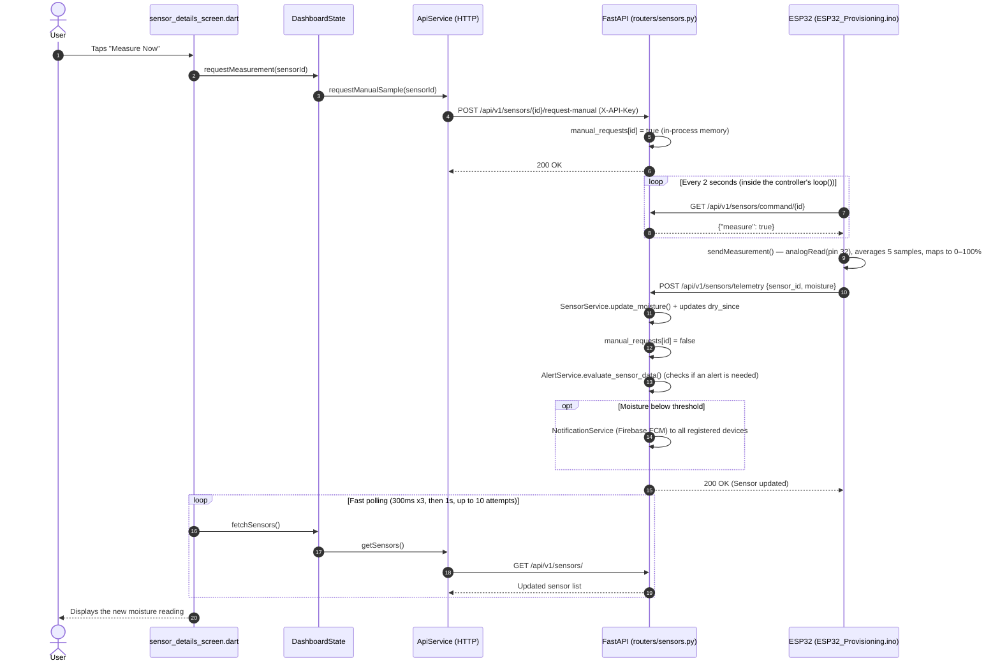
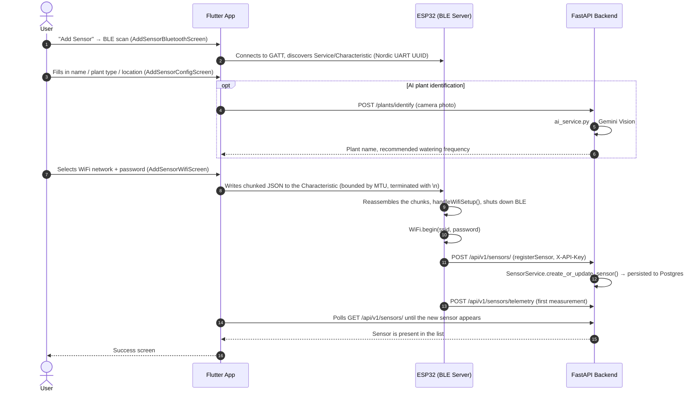

# 🌿 AquaMind – System Architecture

AquaMind is an IoT system for soil-moisture monitoring and watering alerts. It is composed of three parts:

1. **Flutter mobile app** (`frontend/`) – the client through which the user provisions sensors, views live data, and triggers actions.
2. **FastAPI backend** (`backend/`) – runs in the cloud (Render) against a PostgreSQL database, and acts as the intermediary between the app and the hardware.
3. **ESP32 controller** (`ESP32/ESP32_Provisioning/ESP32_Provisioning.ino`) – the firmware actually wired to the soil-moisture sensor.

An important clarification: this is a **monitoring and alerting** system, not automatic irrigation — nothing in the codebase drives a pump, relay, or valve (there is no `pump`/`relay`/`valve` anywhere in the source). When moisture drops below the configured threshold, the backend sends a **push notification** to the user via Firebase, and the user is the one who actually waters the plant.

---

## 🔁 From the App Button to the Controller – Two Distinct Paths

There are two fundamentally different paths from "app" to "hardware," and they're worth keeping separate since they work in completely different ways:

### Path 1: The "Measure Now" Button – Routed Through the Backend

This is the classic "app button → server → controller" path. Note that there is no real-time direct connection between the app and the controller — the server acts purely as a bulletin board: the app leaves a flag on it, and the ESP32 comes around to check it on its own (polling), since there's no way to push a connection into an embedded device sitting behind a home NAT.



**Key files in this path:**
- `frontend/lib/presentation/screens/sensor_details/sensor_details_screen.dart` – the button itself (`_triggerMeasurement`), including the polling loop that waits for a new `lastUpdate`.
- `frontend/lib/presentation/state/dashboard_state.dart` – `requestMeasurement()`.
- `frontend/lib/data/services/api_service.dart` – `requestManualSample()`, `getSensors()`.
- `backend/routers/sensors.py` – `POST /{sensor_id}/request-manual`, `GET /command/{sensor_id}`, `POST /telemetry`. The `manual_requests` flag is an **in-memory dict** (not persisted to the DB), so it resets on every server redeploy/restart.
- `ESP32/ESP32_Provisioning.ino` – `checkRemoteCommand()` (called every 2 seconds from `loop()`) and `sendMeasurement()`.

### Path 2: Adding a New Sensor (Provisioning) – Direct Bluetooth, Bypassing the Backend

Unlike the previous path, here the app talks **directly** to the ESP32 over BLE to hand it WiFi credentials (which must never be routed through an external server). The backend only enters the picture at the very end, once the controller is already connected to the internet on its own.



**Key files:** `add_sensor_bluetooth_screen.dart` → `add_sensor_config_screen.dart` → `add_sensor_wifi_screen.dart` → `add_sensor_success_screen.dart`; on the firmware side, `WriteCallback::onWrite`, `handleWifiSetup()`, `registerSensor()`.

### A Related Path: Periodic Telemetry (No Button Involved)

Even with no user interaction at all, the ESP32 automatically calls `sendMeasurement()` every 60 seconds (`loop()`), and the backend runs the same alert check (`AlertService`) on every sample. This — not the manual measurement — is what actually drives the system's real-world alerts.

---

## 📱 Frontend (Flutter) – `frontend/lib`

Layered architecture (Clean-ish Architecture):

```
presentation/   → Screens and state (UI + ChangeNotifier)
domain/         → Entities, interfaces, use-cases (pure business logic, no Flutter/HTTP dependency)
data/           → Models, services (HTTP), repositories (bridge between domain and data)
```

- **`main.dart`** – Entry point: initializes Firebase, requests push notification permission, registers the FCM token with the backend (`POST /api/v1/devices/register-token`), and sets up a `MultiProvider` with a single `DashboardState` that serves as the global source of truth for the whole app.
- **`presentation/state/dashboard_state.dart`** – The central state manager (`ChangeNotifier`). Holds the sensor list, handles loading/refreshing, manual measurement, create/edit/delete/rename, and fetches weather data (Open-Meteo, called directly from the app — not through the backend) for display in `weather_card.dart`.
- **`presentation/screens/`**:
  - `home/home_screen.dart` – Bottom navigation across 3 tabs (`IndexedStack`, which preserves each tab's state).
  - `dashboard/dashboard_screen.dart` – Home screen: weather card and summary.
  - `sensors/sensors_screen.dart` – List of all sensors.
  - `sensor_details/sensor_details_screen.dart` – Single-sensor screen: "Measure Now" button, moisture threshold/config editing, rename, delete.
  - `add_sensor/*` – The 4-screen provisioning flow described above.
  - `settings/settings_screen.dart` – General settings.
- **`data/services/api_service.dart`** – Wraps every HTTP call to the backend (`http` package). The server URL is hardcoded (`https://aquamind-0xli.onrender.com`), as is an API key (`X-API-Key`) sent with every state-mutating request.
- **`data/repositories/sensor_repository.dart`** – A thin intermediary layer between `ApiService` and `DashboardState`, converting JSON into `Sensor` models.
- **`domain/`** – Defines `SensorRepositoryInterface` and a use-case (`should_water_plants.dart`) independently of the concrete implementation, so business logic isn't coupled to HTTP.
- **BLE (`flutter_blue_plus`) and WiFi (`wifi_iot`, `geolocator`)** – Used exclusively in the provisioning flow, not in day-to-day operation.

---

## 🖥️ Backend (FastAPI) – `backend/`

```
main.py            → App creation, CORS, DB table creation, router registration
routers/           → REST endpoint definitions
services/          → Business logic
models/            → SQLAlchemy models (DB tables)
schemas/           → Pydantic models (input/output validation)
database/db.py     → PostgreSQL connection, per-request session
security.py        → X-API-Key verification
```

### Database
PostgreSQL via SQLAlchemy, with two main tables:
- **`Sensor`** (`models/sensor.py`) – `sensor_id` (normalized MAC address, PK), `name`, `plant_type`, `location_type`, `dry_tolerance_days`, GPS coordinates, `moisture`, `moisture_threshold`, `sync_interval_minutes`, `dry_since` (when moisture first dropped below threshold), `last_update`.
- **`DeviceToken`** – FCM tokens of the user's device(s), used to send push notifications.

### Authentication (`security.py`)
Every endpoint triggered **from the app** that mutates state (create/update/delete/manual-trigger) requires an `X-API-Key` header, checked against the `API_KEY` environment variable. In contrast, the endpoints called **directly by the hardware** (`POST /telemetry`, `GET /command/{id}`) are intentionally left open — a design decision documented directly in the code (`# NOTE: left open... called directly by the ESP32 hardware`).

### Key Endpoints (`routers/`)

| Method | Path | Purpose | Auth |
|---|---|---|---|
| GET | `/api/v1/sensors/` | List all sensors | Open |
| POST | `/api/v1/sensors/` | Create/update a sensor (upsert) | API key |
| PATCH | `/api/v1/sensors/config` | Update moisture threshold and sync interval | API key |
| POST | `/api/v1/sensors/{id}/rename` | Rename a sensor | API key |
| DELETE | `/api/v1/sensors/` / `/all` | Delete a sensor / delete all | API key |
| POST | `/api/v1/sensors/{id}/request-manual` | Set the manual-measurement flag | API key |
| GET | `/api/v1/sensors/command/{id}` | Controller checks for a pending command | Open (hardware) |
| POST | `/api/v1/sensors/telemetry` | Controller reports a moisture reading | Open (hardware) |
| POST | `/api/v1/devices/register-token` | Register the phone's FCM token | API key |
| POST | `/plants/identify` | Identify a plant from a photo (Gemini) | API key |

### Services (`services/`)
- **`sensor_service.py`** – All CRUD logic, including `sensor_id` normalization (`:` → `_` to match a MAC address) and tracking how long a sensor has been "dry" (`dry_since`).
- **`alert_service.py`** – Decides whether to fire an alert. For **outdoor** sensors (`location_type=outdoor`), it dynamically adjusts the effective threshold based on live weather (`weather_service.py`): rain relaxes the threshold, high heat/low humidity tightens it. Exceeding `dry_tolerance_days` escalates the alert level to `CRITICAL`; otherwise it's `WARNING`.
- **`weather_service.py`** – Open-Meteo client with a 15-minute global cache to avoid hitting rate limits.
- **`notification_service.py`** – Sends push notifications via the Firebase Admin SDK (FCM) to every registered token when an alert fires.
- **`ai_service.py`** – Wraps Gemini for photo-based plant identification (used only in the add-sensor screen; unrelated to the irrigation/alert loop).

---

## 🔌 Controller (ESP32) – `ESP32/ESP32_Provisioning/ESP32_Provisioning.ino`

- Reads analog moisture from pin 32 (`SENSOR_PIN`), averages 5 samples, and maps the result to a 0–100% scale.
- On boot: opens a BLE server (`AquaMind Sensor`) for provisioning; once WiFi credentials are received it shuts BLE down — irreversibly until the next reboot (credentials are persisted to `Preferences`/NVS for automatic reconnection).
- After connecting to WiFi: registers with the backend (`registerSensor`), sends an initial measurement, then in the main loop: telemetry every 60 seconds plus a command check every 2 seconds.
- **There is no control over any pump or actuator here** — this is a sense-only node.
